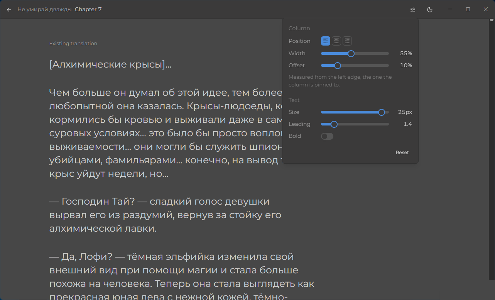
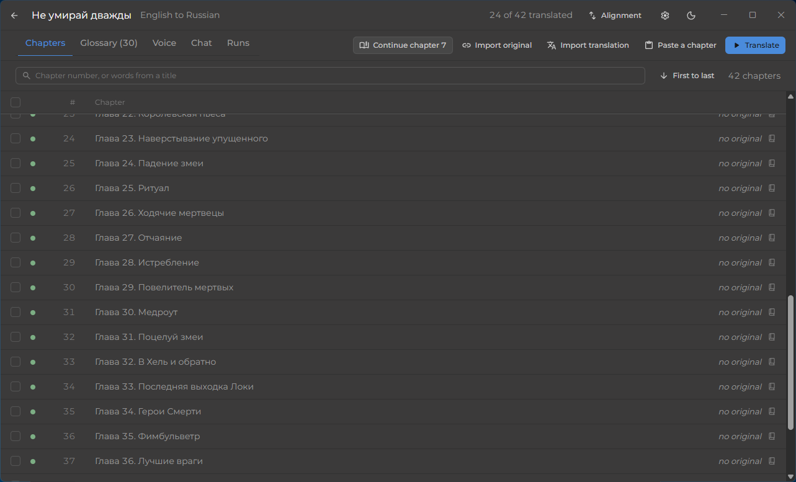
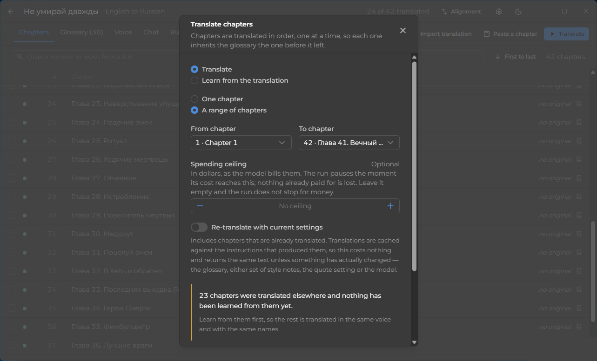

# NektoTranslate

Read web novels in your language before anyone has translated them. NektoTranslate fetches a novel
from its site, translates it chapter by chapter with your own Claude subscription, and gives you a
reader to follow along as the chapters land. Everything stays on your computer.



- **Fetch from a site or paste a chapter.** Hundreds of novel sites are recognised out of the box.
- **Translate like an editor, not a dictionary.** Every chapter is read once, translated a few
  paragraphs at a time, read back, and corrected. Names and terms stay the same from the first
  chapter to the last.
- **Bring an existing translation.** If someone already translated the early chapters, NektoTranslate
  learns their voice and glossary and continues in the same manner - or cleans up a machine
  translation that was let go.
- **Read while it works.** A chapter opens the moment it is finished, in a reader with the original
  beside it when you want it.



Translating is one dialog: pick the chapters, set a spending ceiling if you want one, and go. The
chapters open in the reader as they finish.



## Get it

Open the [latest release](https://github.com/VeyDlin/NektoTranslate/releases/latest). It lists
seven files; you need exactly one of them:

| You are on | Take this file | Then |
|---|---|---|
| **Windows** 10 or 11 | `NektoTranslate_<version>_x64-setup.exe` | Run it. Windows will warn that the publisher is unknown - the installer is not signed yet; choose *More info → Run anyway*. |
| **Linux**, any distribution | `NektoTranslate_<version>_amd64.AppImage` | Make it executable (`chmod +x`, or right-click → Properties → Allow executing) and run it. Nothing to install. |
| Ubuntu, Debian, Mint | `NektoTranslate_<version>_amd64.deb` | `sudo apt install ./NektoTranslate_<version>_amd64.deb`, then start NektoTranslate from the menu. |
| Fedora, openSUSE | `NektoTranslate-<version>-1.x86_64.rpm` | `sudo dnf install ./NektoTranslate-<version>-1.x86_64.rpm`, then start it from the menu. |
| **macOS** | Nothing yet | There is no macOS build so far - see *Build from source* below. |

The other files on that page are not for most people:

- `NektoTranslate_<version>_x64_en-US.msi` is the same Windows application as an MSI package, for
  people who roll software out through Group Policy or Intune. If you do not know what that means,
  take the `-setup.exe`.
- `NektoTranslate.Server-win-x64.zip` and `NektoTranslate.Server-linux-x64.zip` are the application
  without its window, for running it as a small local server and using it in a browser - see
  *Run it without the window* below.

Every file has a `sha256` printed under it on the release page, if you want to check a download.

Nothing else needs installing, with one exception: translation runs through the
[Claude Code](https://docs.claude.com/en/docs/claude-code) command-line tool on your own Claude
subscription, so install it and sign in once:

```
# Windows (PowerShell)
irm https://claude.ai/install.ps1 | iex

# macOS and Linux
curl -fsSL https://claude.ai/install.sh | bash
```

then run `claude` in a terminal and follow the login. NektoTranslate picks it up from there.

## Run it without the window

`NektoTranslate.Server-win-x64.zip` and `NektoTranslate.Server-linux-x64.zip` are the whole
application as a plain program you run and then open in a browser - handy on a machine you reach
remotely, or if you simply prefer your browser. Unzip it anywhere, start `NektoTranslate.Api`
(`NektoTranslate.Api.exe` on Windows) and open the address it prints, `http://127.0.0.1:5080`. It
needs nothing installed, listens only on your own machine, and keeps its data in:

| | |
|---|---|
| Windows | `%LOCALAPPDATA%\NektoTranslate` |
| macOS | `~/Library/Application Support/NektoTranslate` |
| Linux | `~/.local/share/NektoTranslate` |

Two flags cover the unusual cases: `--ServerUrl=http://127.0.0.1:5099` to use another port, and
`--DataDirectory=<path>` to keep the library somewhere else, say on another drive.

## Build from source

The server is .NET 10 (ASP.NET Core, EF Core, SQLite) and serves a Vue 3 client from the same
process; `NektoTranslate.Desktop` is a Tauri 2 shell that starts that server and shows it in a
native window.

```
# server on its own, with the client built into it
dotnet publish NektoTranslate.Server/NektoTranslate.Api -c Release -r win-x64 --self-contained -o <folder>

# desktop application, installers included
cd NektoTranslate.Desktop && npm install && npm run build
```

You need the .NET 10 SDK and Node 22; the desktop build also needs Rust. For day-to-day work run
the API from `NektoTranslate.Server/NektoTranslate.Api` and `npm run dev` in `NektoTranslate.Client`,
which proxies to it. `NektoTranslate.Desktop/README.md` describes the shell, its attach mode and
its window chrome. The version lives in `NektoTranslate.Server/Directory.Build.props`; changing it
on `main` is what cuts a release.

The site parsers under `NektoTranslate.Server/vendor/WebToEpub` are from
[WebToEpub](https://github.com/dteviot/WebToEpub) by David Teviotdale, used with thanks under
their GPL-3.0 licence - which is also why this project is GPL-3.0.
